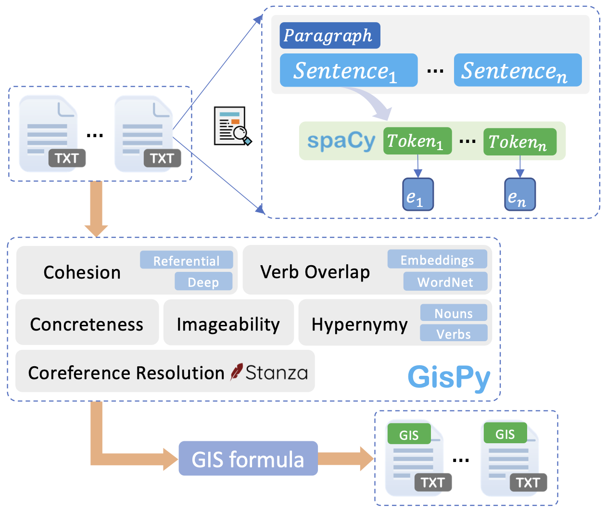

# GisPy: A Tool for Measuring Gist Inference Score in Text

<p align="center">
  
</p>

**What is Gist?** Based on Fuzzy-trace theory (FTT), when individuals read a piece of text, there are two mental representations encoded in parallel in their mind including 1) **gist** and 2) **verbatim**. While verbatim is related to surface-level information in the text, gist represents the bottom-line meaning and underlying semantics of it.

Inspired by the definition of Gist Inference Score (GIS) by [Wolfe et al. (2019)](https://link.springer.com/content/pdf/10.3758/s13428-019-01284-4.pdf) and implementation of coherence/cohesion indices in [Coh-Metrix](http://cohmetrix.com/), we developed `GisPy`, a tool for measuring GIS in text.

### How to run GisPy
1. Install the requirements: `pip install -r requirements.txt`
   * We suggest you create a new virtual environment (e.g., a [conda enviroment](https://docs.conda.io/projects/conda/en/latest/user-guide/tasks/manage-environments.html#creating-an-environment-with-commands)).
   * If you only want to run GisPy and don't need to run jupyter notebooks, you can skip installing the following packages:
      * `matplotlib, textract, wayback`
2. Install the spaCy model: `python -m spacy download en_core_web_trf`  
3. Put all text documents separately as `.txt` files (one document per file) in the `/data/documents` folder.
   * Paragraphs in each document need to be spearated by [at least] one new line character (`\n`).  
4. Run [`/gispy/run.py`](https://github.com/phosseini/gispy/blob/master/gispy/run.py) class: `python run.py [OUTPUT_FILE_NAME]`
    * `OUTPUT_FILE_NAME`: name of the output file in `.csv` format where results will be saved.


### List of files
* **Benchmark 1**: [wolfe_reports_editorials.csv](https://github.com/phosseini/GisPy/blob/master/data/benchmarks/wolfe_reports_editorials.csv)
* **Benchmark 2**: [wolfe_methods_discussion.csv](https://github.com/phosseini/GisPy/blob/master/data/benchmarks/wolfe_methods_discussion.csv)
* **Benchmark 3**: [Disney](https://github.com/phosseini/GisPy/tree/master/data/benchmarks/disney)
* [`experiments.ipynb`](https://github.com/phosseini/GisPy/blob/master/notebooks/experiments.ipynb): all experiments including the robustness tests on three benchmarks.
* [`benchmarks.ipynb`](https://github.com/phosseini/GisPy/blob/master/notebooks/benchmarks.ipynb): preprocessing Wolfe's benchmark files.

### Gist Inference Score (GIS) formula

```
GIS = Referential Cohesion 
      + Deep Cohesion 
      + (LSA Verb Overlap - WordNet Verb Overlap) 
      - Word Concreteness 
      - Imageability 
      - Hypernymy Nouns & Verbs
```

### Citation
```bibtex
@article{hosseini2022gispy,
  title={GisPy: A Tool for Measuring Gist Inference Score in Text},
  author={Hosseini, Pedram and Wolfe, Christopher R and Diab, Mona and Broniatowski, David A},
  journal={arXiv preprint arXiv:2205.12484},
  year={2022}
}
```
